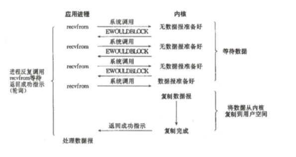

# 我的RPC框架

## 1. Zookeeper实现注册中心
- 服务的服务端服务启动的同时，将服务提供者信息（主机IP地址、服务端口、服务接口类路径）组成的znode路径写入Zookeeper中，注意写入的叶子节点为临时节点。这样就完成了服务的注册动作；
- 服务的消费端在发起服务调用之前，会先连接到Zookeeper，对服务提供者节点路径注册监听器，同时获取服务提供者信息到本地缓存，发起调用的时候，调用者会从服务提供者本地缓存列表中运用某种负载均衡策略选取某一个服务提供者，对该服务提供者发起调用，最终完成本次服务调用。这样就完成了服务发现动作；
- 若服务提供者集群中某台机器下线，该机器与注册中心zookeeper的连接会断掉，因为服务注册写入信息的叶子节点写入的znode是临时节点。同时出触发服务消费端对服务提供者路径的监听器，服务消费端收到被删除服务提供者节点信息之后，刷新本地服务提供者信息缓存，从缓存中删除已下线的服务提供者信息。若有新服务提供者上线，原理类似；

## 2. 关于neety半包/粘包问题。
### 产生原因：
- 应用程序写入的数据大于套接字缓冲区大小，这将会导致半包现象；
- 应用程序写入数据大小套接字缓冲区大小，网卡将应用多次写入的数据发送到网络上，这将会发生粘包现象；
- 当TPC报文长度减去TCP头部长度大于MSS（最大报文长度）的时候将发生半包；
- 接收方法未能及时读取套接字缓冲区数据，将发生粘包；
- 接收方法未能及时读取套接字缓冲区数据，将发生粘包。
### 解决方法：
  解决粘包/半包问题的本质能够区分完整的业务应用数据边界，能够按照边界完整地接受Netty传输的数据
- DelimiterBasedFrameDecoder+StringDecoder利用特殊分隔符作为消息的结束标志；eg: "@#"
- LineBasedFrameDecoder+StringDecoder组合以换行符作为消息的结束标志； eg: "\n"，"\r\n"
- FixedLengthFrameDecoder+StringDecoder按照固定长度获取消息。
### 自定义编解码器解决Netty粘包半包问题
  这里，我使用自定义编解码器来解决粘包半包问题，也就是使用Netty中的MessageToByteEncoder与ByteToMessageDecoder来自定义编解码器，大致原理：
  使用int数据类型来记录整个消息的字节数组长度，将该int数据作为消息的消息头一起传输，在服务端接收消息数据的时候，先接收4个字节的int数据类型数据，这个数据即为整个消息字节数组的长度，再接收剩余字节，直到接收的字节数组长度等于最先接收的int数据类型大小。

## 3. 负载均衡策略
  我主要通过在消费者端实现软负载均衡，主要实现了随机、加权随机、轮询、加权轮询、源地址hash
- 服务消费端在应用启动之初从服务注册中心获取服务提供者列表，缓存到服务调用端本地缓存；
- 服务消费端发起服务调用之前，先通过某种策略或者算法从服务提供者列表本地缓存中选择本次调用的目标机器，再发起服务调用，从而完成负载均衡的功能。

## Netty客户端发起调用，重点需要解决的问题是：
（1） 选择合适的序列化协议，解决Netty传输过程中出现的半包/粘包问题。
（2） 发挥长连接的优势，对Netty的Channel通道进行复用。通常通过连接池技术来达到复用效果。
（3） Netty是异步框架，客户端发起服务调用后同步等待获取调用结果。可以通过为每个请求新建一个阻塞队列，返回结果的时候，存入该阻塞队列，若再超时时间内返回结果值，则调用端将该返回结果从阻塞队列中取出返回给调用方，否则超时，返回null。


## 一、远程服务的发布与引入

服务发布与引入通过Spring管理，进而远程服务发布Bean与远程服务引入Bean通过Spring IOS容器管理，由Spring管理其生命周期。实现了远程服务调用编程界面与本地Bean方法调用的一致性，屏蔽了远程服务调用与本地方法调用的差异性。

### 1. 远程服务的发布（通过实现FactoryBean来定义，方便IOC配置）

远程服务自身的属性定义如下：

```java
// 服务接口
private Class<?> serviceItf;
// 服务实现类
private Object serviceObject;
// 服务端口
private String serverPort;
//服务超时时间，暂时没有用到，以客户端设置的为准
private long timeout;
//服务代理对象,暂时没有用到
private Object serviceProxyObject;
//服务提供者唯一标识，设置这个参数为了防止有多个不同的应用服务接口名字相同
private String appKey;
//服务分组组名，服务分组功能暂时没有用到
private String groupName = "default";
//服务提供者权重,默认为1 ,范围为[1-100]
private int weight = 1;
//服务端线程数,默认10个线程，服务端使用此参数对每个接口的并发调用数进行控制，限流
private int workerThreads = 10;
```

#### 1.1 远程服务的发布流程

详细请看[源代码](https://github.com/zrx318/myRPC-Java-Demo/blob/master/src/main/java/com/rongxin/provider/ProviderFactoryBean.java)

1. 启动Netty服务端
2. 启动ZooKeeper，将服务提供者属性信息注册到注册中心

注意到两个特别的方法`void afterPropertiesSet()`、`List<ProviderService> buildProviderServiceInfos()`:

**afterPropertiesSet()**：

​	`afterPropertiesSet()`是借口`InitializingBean`中定义的方法。该接口会在`Spring Bean`初始化的时候自动执行一次，我们一般会使用该方法来初始化某些资源。这里主要做了两件事：

- 调用NettyServer.singleton().start()方法来**启动Netty客户端**，**将服务对外发布出去**，使其能够接受外部其他机器的调用请求
- **将服务写入Zookeeper，保存在注册中心**

List<ProviderService\>:

​	这个主要是将我的提供者进行方法力度拆分为多个方法，提供方法粒度的服务。比如我有个`HelloService`，并且有两个服务方法，一个`SayHello()`，一个`SayHi()`,那么我就拆分为两个服务，请求我还会调用注册中心的方法`registerCenter4Provider.registerProvider()`来完成服务端信息的注册。

​	在我的例子中有实现HelloService并且在impl中进行实现，通过XML配置来进行ioc的注册。

### 2. 远程服务的引入

远程服务引入相关的属性定义如下：

```java
//服务接口
private Class<?> targetInterface;
//超时时间
private int timeout;
//服务bean
private Object serviceObject;
// 负载均衡策略
private String clusterStrategy;
//服务提供者唯一标识
private String remoteAppKey;
//服务分组组名
private String groupName = "default";
```

远程服务的类我是这样定义的：

```java
public class InvokerFactoryBean implements FactoryBean, InitializingBean
```

其实引入远程服务主要也是在`afterPropertiesSet()`方法中实现的，这个方法中的步骤主要是：

- 获取服务的注册中心，将服务提供者信息获取到本地缓存列表中
- 初始化`Netty`连接池，通过连接池可以实现长连接复用，有利于提高服务调用性能
- 获取服务**提供者代理对象**
- 将服务消费者信息注册到注册中心

实际的XML配置来注册IOC容器与服务的发布差不多~

说道XML配置，如果通过Spring本身的配置bean标签的方式呢，就太难受了，比如我要配置一个HelloService，我上面我刚刚列出的那么多属性要一个一个的配置`property`标签，冗长又难受，反正学习Spring，那我倒不如再来个定制版的XML标签，请看我是怎么实现的

### 3. 服务注册中心的实现

类签名：```public class RegisterCenter implements IRegisterCenter4Invoker, IRegisterCenter4Provider, IRegisterCenter4Governance {```}

说白了就是要实现1、2中调用的注册中心来注册服务和发现服务的功能嘛，所以就实现了服务提供者和发现者两个接口。那下面来看究竟是怎么**发现**和**注册**的。

#### 3.1 流程解析

1. 首先从`properties`文件获取ZooKeeper配置信息，依次为主机地址列表ZK_SERVICE、会话超时时间`ZK_SESSION_TIME_OUT`、连接超时时间`ZK_CONNECTION_TIME_OUT`
2. 方法`registerProvider()`完成服务提供者信息注册服务中心功能。注册的时候要对`RegisterCenter.class`加锁，防止重复注册。服务提供者为一个Map，key是服务提供接口，value是服务方法列表。连接上ZK后，创建临时节点，服务注册就算完成了~~
3. 服务发现很简单，直接监听节点路径即可，一旦节点有变化，将自动更新本地服务提供者缓存信息。


## 二、在Spring中定制我自己的XML标签

​	我先说下我是这么几步来定义的吧：

1. 先定义自定义的标签命名空间，路径与构成规则，首先在工程目录`src/main/resources/META-INFO`下定义`remote-reference.xsd`文件，主要就定义一些属性的名字以及属性是什么数据类型

   举个栗子：

   ```xml
   <xsd:element name="reference">
       <xsd:complexType>
           <xsd:complexContent>
               <xsd:extension base="beans:identifiedType">
                   <xsd:attribute name="interface" type="xsd:string"/>
                   <xsd:attribute name="timeout" type="xsd:int" use="required"/>
                   <xsd:attribute name="clusterStrategy" type="xsd:string" use="optional"/>
                   <xsd:attribute name="remoteAppKey" type="xsd:string" use="required"/>
                   <xsd:attribute name="groupName" type="xsd:string" use="optional"/>
               </xsd:extension>
           </xsd:complexContent>
       </xsd:complexType>
   </xsd:element>
   ```

2. 然后将上面定义好的xsd文件路径添加到spring.schemas文件中去:

   举个栗子：

   ```
   http\://www.wm-remoting.com/schema/wm-service.xsd=META-INF/remote-service.xsd
   http\://www.wm-remoting.com/schema/wm-reference.xsd=META-INF/remote-reference.xsd
   ```

3. 定义解析自定义的标签的工具类`RxRemoteReferenceNamespaceHandler`，为远程服务引入自定义标签处理类：

   举个栗子：

   ```java
   public class RxRemoteReferenceNamespaceHandler extends NamespaceHandlerSupport {
       @Override
       public void init() {
           registerBeanDefinitionParser("reference", new InvokerFactoryBeanDefinitionParser());
       }
   }
   ```

4. 从3中可以看出，我们需要实现一个解析标签属性的类，这个类可以直接继承实现`AbstractSingleBeanDefinitionParser`来完成：

   举个栗子：算了不举了，反正就是对我的属性进行一个定义嘛~

   

   通过上面的步骤，我们就可以使用这个标签了，我举一个服务引用的标签来展示吧~：

   ```xml
   <WmClient:reference id="remoteHeiheiServiceTemp"
                         interface="com.michaelwang.test.HeiheiService"
                         clusterStrategy="WeightRandom"
                         remoteAppKey="wm"
                         groupName="default"
                         timeout="3000000"/>
   ```

   明显比那个通过ioc容器的bean标签来定义配置爽多了~

---

今天是2020年7月12日23:55:27，下次继续努力~

---


## 三、底层通信实现

先介绍我了解的几种IO模型：

- **阻塞IO**：默认情况下，所有文件操作都是阻塞的。在进程空间中调用recvfrom，其系统调用直到数据包到达且被复制到应用进程的缓冲区中或者发生错误才返回，这个期间会一直等待，进程调用recvfrom开始到它返回的整段时间内都是被阻塞的，如下图：


- **非阻塞IO**：当内核没有准备好数据时，直接返回一个错误，所以不会等待数据完成。调用方的话可以通过反复调用recvfrom等到返回成功标志。



- **IO复用**：Linux提供select/poll，进程通过将一个或多个fd传递给select或poll系统调用，**阻塞**在select。然后select/poll就可以去轮询进程传递的fd，查看fd是否就绪。linux还提供一个epoll，是基于事件驱动的，意思就是当有fd准备就绪时，立即回调函数rollback

### 


